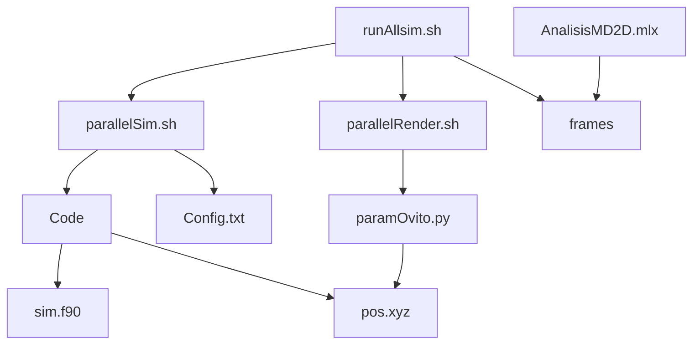

# Simulación 2D Dinámica Molecular

---


---

## Pre requisitos

> [gfortran]([Installing GFortran &#8212; Fortran Programming Language](https://fortran-lang.org/learn/os_setup/install_gfortran/))
> 
> [ovito 3.7 ]([Old OVITO Downloads — OVITO](https://www.ovito.org/download_history/#3.7.1))
> 
> [python]([How to Install Python 3 on Ubuntu 20.04 or 22.04 | phoenixNAP KB](https://phoenixnap.com/kb/how-to-install-python-3-ubuntu))
> 
> [MatLab]([Infraestructura Campus-Wide License de MATLAB - MATLAB &amp; Simulink](https://la.mathworks.com/academia/tah-support-program/eligibility.html)) 

Este repositorio contiene una pipeline completa para la simulación renderizado y análisis de un sistema de doscientas partículas en dos dimensiones. Se utilizo un potencial de tipo Leenard Jhones. 

Las configuraciones para el sistema se pueden ver en el archivo **config.txt** 

Se ejecuta la simulación para temperaturas desde 0.01 hasta 1 con un paso de 0.01 en paralelo mediante el script de **paralalleSim.sh** posteriormente se creo el script de **paramOvito.py** para generar el renderizado de las imágenes mediante el programa Ovito a su vez este se manda a llamar en paralelo en el script de **paralleRender.sh** y por ultimo se genero el script de **runAllSim.sh** para ejecutar todo este proceso de manera continua. 

Los datos de la simulacion están disponibles como un dataset de kaggle y se pueden consultar en este [enlace]([Datos dinamica molecular 2D | Kaggle](https://www.kaggle.com/datasets/miguelangelespindola/datos-dinamica-molecular-2d/settings)) 



## Condiciones iniciales

Estas se definen en el archivo **config.txt**  y se replican en el **parallelSim.sh**

```context
200        ! cantidad de particulas
100        ! Largo del eje x
50         ! Largo del eje y
1000000    ! Numero de pasos
0.0001     ! Paso de integracion
1000       ! Guardar cada n pasos
0.90       ! temperatura esta cambiara en el archivo parallelSim.sh
```

## Simulación

Esta se encuentra descrita dentro del archivo **sim.f90** y contiene las siguientes subrutinas 

```fortran
! lee el archivo config.txt para almacener las condiciones iniciales
call leerContiguracion 
! Genera las posiciones iniciales de las particulas dentro de la 
! la caja de simulacion
call generarPosiciones
! guardar las posiciones iniciales de las particulas en el archivo 
! pos.xyz
call guardarPosiciones
! genera las velocidades de todas las particulas de forma aleatoria
call generarVelocidades
! calcula las fuerzas iniciales utilizando el potencial de LJ y el
! metodo de verlet  
call calcularFuerzas
! ejecuta el loop de la simulacion, es la subrutina mas importante 
! en el programa
call ejecutarSimulacion
! contiene los parametros para calcular el potencial de Leenard Jhones
call leenardJhones
```

## Compilacion

Para poder ejecutar la simulación en forma paralela para distintas temperaturas primero debemos de general el ejecutable con la siguiente instrucción en la terminal

```bash
gfortran -std=legacy -o code sim.f90 -O3
```

Posteriormente usaremos este archivo dentro del script **parallaleSim.sh**

## Ejecución en paralelo de la simulación

La manera mas efectiva y sencilla de acelerar el estudio fue implementando una paralelizacion trivial esto quiere decir que ejecutamos la misma simulación pero para temperaturas diferentes y de esta manera no tenemos dependencia entre los datos y no requerimos usar herramientas como MPI o openMP. Esto se logro utilizando gnu parallel y se implemento dentro del archivo **parallelSim.sh** y **parallelRender.sh**

Para lograr esta tarea se creo una función que crea las carpetas donde se almacenara la simulación de esa temperatura así como el archivo **config.txt** agregándole la temperatura deseada y manda a llamar el archivo **code** y lo ejecuta en ese directorio, este proceso se puede paralelizar debido a que cada directorio es independiente y podemos tener tantas simulaciones como núcleos tengamos disponibles

```bash
run_sim() {
        RUNDIR=run_$1
        mkdir ${RUNDIR} # se genera la carpeta de la temperatura
        {
        . # aqui se agregan las condiciones iniciales
        .
             echo "$1" # se guarda la temperatura
        } > ${RUNDIR}/config.txt # se genera el archivo y se guarda en
        # la carpeta 
        (cd ${RUNDIR} ; ../code) # se ejecuta el codigo en la carpeta
}

export -f run_sim
# esta es la linea mas importante pues hace que la funcion se ejecute 
# en paralelo, tomamos valores para la temperatura desde 0.01 hasta 1
# con paso de 0.01, se lanzaran tantas simulaciones como nucleos 
# logicos dispongamos, en mi caso son 16
parallel run_sim ::: $(seq 0.01 0.01 1)
```

## Renderizado de la simulación

Como en el fenómeno que estamos estudiando se forman gotas no podemos calcular la densidad de una manera tradicional así que se renderizaron imágenes de la simulación como si tomáramos fotografías para utilizar técnicas de procesamiento de imágenes como calcular el área en una imagen binaria. Esto nos permite tener una medida mas acertada de las densidades así como una forma sencilla y paralelizable del computo.

Para generar los renders de la simulacion se utilizo la api de ovito la cual puede ser consumida en el lenguaje python, se escribió el script de **paramOvito.py** para posteriormente mandarlo a llamar de forma paralela con el script **paralellRender.sh** como se hizo anteriormente

```python
import PySide6.QtWidgets
app = PySide6.QtWidgets.QApplication() 
```

Debido a que para renderizar ovito ocupa el motor de OpenGL y este se lanza a través de una aplicación de Qt tal como lo haría su aplicación de escritorio lo primero que debemos de hacer es crear una sesión de Qt para permitir este proceso.

```python
# estos ajustes se pueden cambiar desde la app de ovito para encontrar
# los ideales si se cambia el tamaño de la caja de simulacion
vp.type = Viewport.Type.Perspective
vp.camera_pos = (50,25,70)
vp.camera_dir = (0,0,-1)
vp.fov = math.radians(60.0)

# se importa el archivo de las posiciones que se genero en la
# simulacion
pipeline = import_file("pos.xyz")
pipeline.add_to_scene()
# se modifica el color de las particulas
pipeline.modifiers.append(AssignColorModifier(color=(1.0,1.0,1.0)))
# esta es la parte mas importante del programa
# se generan mil frames debido a que se tienen 10000000 de pasos de 
# integracion y se guarda informacion cada 10000 lo cual al hacer la 
# operacion 10000000/10000 = 1000 frames
for j in range(0,1000):
    name = "frame"+str("{:03d}".format(j))+".jpg"
    # esta linea es la que genera los frames
    # establecemos el tamaño deseado asi como el nombre del archivo
    # especificamos un fondo negro para que contraste con las particulas
    # seleccionamos el frame que queremos renderizar
    # especificamos el motor grafico que usaremos
    vp.render_image(size=(800,600),filename=name,background=(0,0,0),frame=j,renderer=OpenGLRenderer())
```

## Ejecución en paralelo del renderizado

Como el renderizado es un proceso fácil de paralelizar se procedió a crear el archivo **paralleRender.sh** el cual implementa la misma técnica que el **paralalleSim.sh**

```bash
run_sim() {
        RUNDIR=run_$1
	    (cp paramOvito.py ${RUNDIR})
	    (echo "Iniciando el render en $RUNDIR")
        (cd ${RUNDIR} && python3 paramOvito.py)
}

export -f run_sim
parallel run_sim ::: $(seq 0.01 0.01 1)
```

Se manda a llamar al script **paramOvito.py** y se ejecuta dentro de cada carpeta de temperatura.

## Análisis de los resultados

A lo que nosotros queremos llegar es poder obtener un perfil de densidad en función de la temperatura, para esto generamos el script de **AnalsisMDM** el cual utiliza algunas funciones de matlab para el procesamiento de las imágenes. 

```matlab
data = imageDatastore(ruta,"FileExtensions",'.jpg');
```

Se genera un `imageDatastore` de manera parametrica para incluir todas las imágenes de una carpeta.

```matlab
% se lee el archivo y se genera una imagen binaria
imtep = imbinarize(rgb2gray(imread(data.Files{j})));
% se recorta la imagen al tamaño de la caja de simulacion
imtep = imtep(110:end-110,25:end-25);
% se obtiene el area en pixeles de la caja de simulacion
area = min(size(imtep))*max(size(imtep));
% se obtiene el area de donde hay particulas
imtemp = bwarea(imtep);
% se saca la densidad y se guarda en el vector restemp
restemp(j) = imtemp/area;
```


